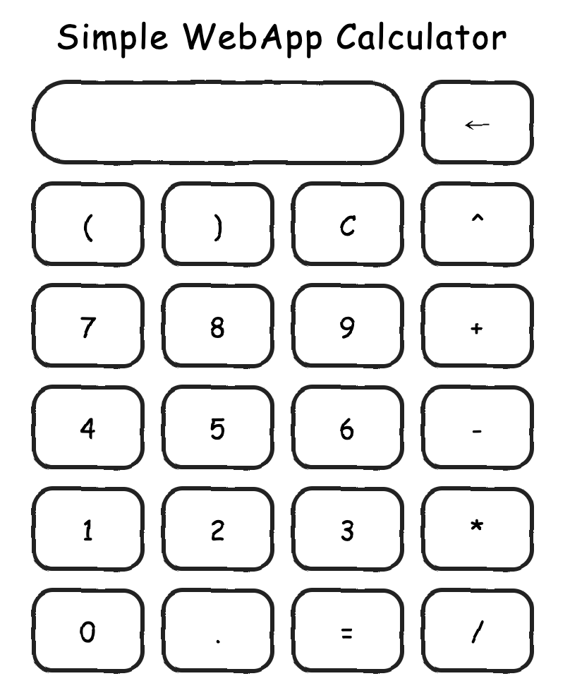

# WebApp Simple Calculator
## By mhasanali2010

## Screenshot

## Tech Stack
- Frontend:
    - HTML
    - CSS
    - JavaScript
- Backend:
    - Python (Flask)
- External Python Libraries:
    Mentioned in `requirements.txt`

## Working
Expression written in input box is posted to the flask backend which evaluates it using evaluate from math_evaluate.evaluator from the [math-evaluate](https://github.com/mhasanali2010/math-evaluate) repository.

## Using Locally
- Clone the repository and navigate to it.
    ```bash
    git clone https://github.com/mhasanali2010/webapp-simple-calculator
    cd webapp-simple-calculator
    ```
- Navigate to `backend` folder:
    ```bash
    cd backend
    ```
- Host the backend locally using and navigate out of the backend folder
    ```bash
    python app.py
    cd ..
    ```
- Navigate to frontend folder:
    ```bash
    cd frontend
    ```
- Open `script.js` and edit the first line `const backendURL = ...` to be `https://localhost:5000`.
- Open `index.html`.